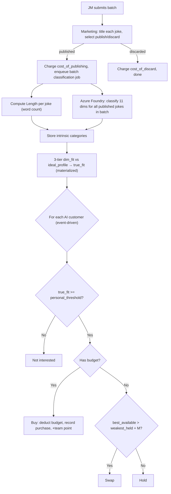
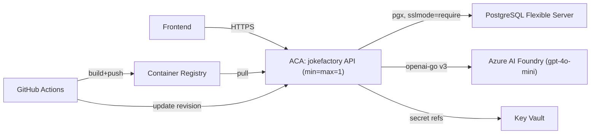

# Joke Factory Backend — Refactor Plan (Phase-Driven)

> Organized so you implement **top-to-bottom, one phase at a time**. Sections 1–3 are shared reference (domain rules + architecture used across phases). Section 4 is the phased build — **each phase is self-contained** (schema slice, code/files, endpoints, tests, Definition of Done). Appendices give consolidated indexes + Azure deployment.

---

## 1. Overview — what's changing

- **Human customers → AI customers.** The `CUSTOMER` role is gone; simulated AI customers judge published jokes and buy them.
- **QC → Marketing.** The 1–5 rating system is removed. Marketing titles jokes and chooses which to publish vs discard.
- **LLM classification.** Published jokes are classified on 12 dimensions via **Azure AI Foundry** (`gpt-4o-mini`), one call per batch.
- **3-tier scoring.** Jokes are scored for fit against a hidden instructor "ideal profile" (validated in the classifier sandbox to separate good vs bad jokes).
- **New profit model** (publish/discard costs) + **reworked feedback** (per-dimension Good/Improve). Instructor **stats/summary keep the existing live FE contracts** (leaderboard + team card only — no new chart payloads).
- **Architecture refactor**: split the god repository, add LLM ports/adapters, worker-pool pipeline.
- **Hosting**: migrate Render + Neon → **Azure**.
- **Schema**: greenfield — one consolidated migration (`0001_schema.sql`), not an incremental chain from the old system.
---

## 2. Design Reference (shared across phases)

### 2.1 The 12 judging dimensions
Each joke is classified into exactly one category per dimension.

| # | Dimension | Categories | Classified by | Scoring type |
|---|-----------|-----------|---------------|--------------|
| 1 | Length | Short, Medium, Long | **Code** (word count) | Ordinal |
| 2 | Topic | Work, Relationships, Family, Food, Technology, Animals, School, Money, Travel, Health, Sports, Politics, Everyday, Language, Other | LLM | Categorical |
| 3 | Humor Style | Pun, Observational, Irony, Absurdity, Exaggeration, Self-deprecating, Anti-joke, Callback, None of the above | LLM | Categorical |
| 4 | Complexity | Very simple, Simple, Moderate, Thoughtful, Expert | LLM | Ordinal |
| 5 | Edginess | Clean, Slightly edgy, None of the above | LLM | Categorical |
| 6 | Structure | One-liner, Setup–punchline, Question–answer, Short story, Dialogue/conversation, List/build-up, None of the above | LLM | Categorical |
| 7 | Wordplay | None, Light, Moderate, Heavy | LLM | Ordinal |
| 8 | Freshness | Timeless, Slightly current, Current, Very topical, Time-sensitive | LLM | Ordinal |
| 9 | Setup→Payoff | Immediate, Quick, Balanced, Long, Very long build | LLM | Ordinal |
| 10 | Clarity | Crystal clear, Mostly clear, Slightly ambiguous, Ambiguous, Reinterpretation | LLM | Ordinal |
| 11 | Energy | Deadpan, Low, Conversational, Animated, High-energy, None of the above | LLM | Ordinal |
| 12 | Title Fit | Perfect, Strong, Moderate, Weak, Mismatch | LLM | Graded (intrinsic) |

- **Length** via word count: Short ≤15, Medium 16–40, Long ≥41.
- **Title Fit** is intrinsic (no ideal selector) — how well the title matches the joke's theme.
- **"None of the above"** always scores `0` against any normal ideal.

### 2.2 Scoring model — 3-tier
- **Ordinal dims** (Length, Complexity, Wordplay, Freshness, Setup→Payoff, Clarity, Energy):
  - `1.0` exact match · `0.5` adjacent (one step in the ordered list) · `0.0` otherwise.
- **Categorical dims** (Topic, Humor Style, Edginess, Structure): `1.0` exact match · `0.0` else.
- **Title Fit** (graded, intrinsic): `Perfect=1.0, Strong=0.75, Moderate=0.5, Weak=0.25, Mismatch=0`.
- **`true_fit` = sum of all 12 `dim_fit`** → range `0–12`.

### 2.3 Buy / swap mechanics
- Each AI customer has a **personal threshold** = `buy_threshold + uniform_random(-jitter, +jitter)`, fixed at round start.
- **Buy:** if `true_fit >= customer_threshold` AND budget available → buy (deduct `market_price`, +team point).
- **Swap (out of budget):** if `best_available.true_fit > weakest_held.true_fit + swap_margin` → return weakest, buy better. Every held joke must satisfy the threshold. Ties broken randomly.

### 2.4 Instructor-configured parameters
| Parameter (key) | Description | Default |
|-----------------|-------------|---------|
| `ideal_profile` | Hidden ideal category per dimension (11 selectable dims); locked at round start | (per-dim) |
| `buy_threshold` (τ) | Min `true_fit` to buy | `7` |
| `jitter` | Per-customer threshold noise | `±0.3` |
| `swap_margin` (M) | Min improvement to swap when out of budget | `0.5` |
| `customer_count` | AI customers per round | `100` |
| `customer_budget` | Starting currency per AI customer | `$3.00` |
| `market_price` | Revenue per sale | `$1.00` |
| `cost_of_publishing` | Cost per published joke | `$0.10` |
| `cost_of_discard` | Cost per discarded joke | `$0.01` |
| `batch_size` | R1 fixed / R2 cap | `5` |
| `feedback_joke_count` | Jokes shown in feedback | `3` |
| `feedback_pass_threshold` | `dim_fit` cutoff for a "good" dimension | `0.75` |

### 2.5 Profit model
```
profit = (sold_jokes × market_price)              // sold_jokes = total purchases
       − (published_jokes × cost_of_publishing)
       − (discarded_jokes × cost_of_discard)       // discarded = created − published
```

### 2.6 End-to-end flow


---

## 3. Target Architecture & Design Patterns

Extends the existing hexagonal design and fixes the two big smells: the ~45-method god `GameRepository` and the ~1850-line `postgres_repository.go`.

### 3.1 Target package structure
```
src/
  app/
    server/                     # router, DI wiring, lifecycle
    http/{handler,dto,response}/# thin handlers; wire structs + mappers
    middleware/
  core/
    domain/
      entities.go  enums.go  errors.go
      scoring/                  # pure, unit-tested, zero deps
        dimensions.go  length.go  fit.go
    ports/                      # interfaces
      repository.go             # split per-aggregate (3.3)
      classifier.go             # LLM abstraction
      dispatcher.go             # classification queue abstraction
    usecase/                    # one service per bounded context
      session.go instructor.go batch.go marketing.go
      classification.go aicustomer.go feedback.go stats.go
  infra/
    config/  logger/
    db/{migrations,postgres.go} # postgres.go holds WithTx unit-of-work
    repo/postgres/              # one file per aggregate + mapper.go
    llm/                        # Azure Foundry adapter (ports.Classifier)
    worker/                     # dispatcher + worker pool + reconciler (ports.Dispatcher)
```

### 3.2 Design patterns applied
- **Ports & Adapters:** `core` has no I/O. New driven ports `Classifier` and `ClassificationDispatcher`; adapters in `infra/llm` and `infra/worker` (fully mockable).
- **Interface Segregation:** split `GameRepository` into per-aggregate interfaces (3.3); services depend only on what they use.
- **Service per bounded context**, depending on ports only.
- **Pure domain service** for scoring (no DB/clock/rand).
- **Unit of Work:** `WithTx(ctx, fn)` for multi-table ops (publish, buy, swap, start).
- **Dispatcher + Worker Pool:** `Dispatcher.Enqueue(job)` hides the channel; startup **reconciler** re-enqueues orphans.
- **DTO mapping / anti-corruption:** domain never leaks to the wire (e.g. hide `ideal_profile` from students).
- **Explicit DI** in `main.go` / `server.New`; **inject clock + rand** for deterministic tests.

### 3.3 Repository interface split
```go
// core/ports/repository.go
type UserRepository interface { /* users, participants, assignment */ }
type TeamRepository interface { /* teams, team_rounds_state */ }
type RoundRepository interface { /* rounds, ideal_profile, config, start/end */ }
type BatchRepository interface { /* batches, jokes, submit, list */ }
type MarketingRepository interface { /* queue claim/lock, publish/discard */ }
type ClassificationRepository interface { /* jobs, dimension_values, dim_fit, joke_fit */ }
type AICustomerRepository interface { /* generate, list, buy, swap, holdings */ }
type StatsRepository interface { /* leaderboard, team summary, feedback reads */ }
```
A single `infra/repo/postgres` package implements all of them (composed struct), split into one file per aggregate.

---

## 4. Implementation Phases

Rules for every phase: (a) app **compiles + `make verify` passes**, (b) **independently mergeable**, (c) explicit **Definition of Done**. Schema is **greenfield** — shipping uses a single `0001_schema.sql`; phase Schema blocks below describe the *logical* tables introduced in that phase (historical build order), not a multi-file migration chain.

---

### Phase 0 — Scaffolding & guardrails
**Goal:** structure + safety nets before touching behaviour.

**Code / files**
- Confirm `make verify` is green on `main`; cut a feature branch.
- Create empty target packages (`core/domain/scoring`, split `core/ports`, `infra/llm`, `infra/worker`, `infra/repo/postgres`).
- Add `WithTx(ctx, func(pgx.Tx) error)` helper in `infra/db/postgres.go`.
- Add `.github/workflows/verify.yml` running `make verify` on PRs.

**Schema:** none.
**Endpoints:** none.
**DoD:** builds green; empty packages + WithTx in place; CI runs on PRs.

---

### Phase 1 — Domain + Scoring (pure, TDD)
**Goal:** the 3-tier scoring, dimension config, and Length classifier — no DB.

**Code / files**
- `core/domain/enums.go`: `Role` (INSTRUCTOR/JM/MARKETING), statuses, `Dimension`, `PublishStatus`, `ClassificationStatus`.
- `core/domain/scoring/dimensions.go`: category lists (2.1), ordinal order, catch-alls, which dims have an ideal.
- `core/domain/scoring/length.go`: word-count classifier (≤15 / 16–40 / ≥41).
- `core/domain/scoring/fit.go`: `DimFit(dim, ideal, joke)` (3-tier) and `TrueFit(classification, profile)`.

**Schema:** none.
**Endpoints:** none.
**Tests:** unit tests for each scoring type; the sandbox worked example → `9.75/12`; an "opposite" joke → near `0`.
**DoD:** `scoring` package fully unit-tested, zero external deps.

---

### Phase 2 — Core schema + repository split
**Goal:** new DB foundation + segregated repo interfaces (no new features yet).

**Schema** — migration `0004_core.sql`:
- Enums: `user_role(INSTRUCTOR,JM,MARKETING)`, `round_status(CONFIGURED,ACTIVE,ENDED)`, `batch_status(DRAFT,SUBMITTED,PROCESSED)`, `participant_status(WAITING,ASSIGNED)`, `joke_publish_status(PENDING,PUBLISHED,DISCARDED)`.
- `teams(id, name UNIQUE, created_at)`
- `users(user_id, display_name, role NULL, team_id NULL, status, assigned_at, joined_at, created_at)` + CHECK: null role ⇒ null team; JM/MARKETING ⇒ team NOT NULL; INSTRUCTOR ⇒ team NULL.
- `rounds(round_id, round_number, status, batch_size, market_price, cost_of_publishing, cost_of_discard, customer_budget, customer_count, buy_threshold, jitter, swap_margin, feedback_joke_count, feedback_pass_threshold, is_popped_active, started_at, ended_at, created_at)`
- `round_ideal_profile(round_id, dimension, ideal_category, PK(round_id,dimension))` — excludes TITLE_FIT.
- `team_rounds_state(round_id, team_id, points_earned, batches_created, batches_processed, published_jokes, discarded_jokes, created_at, updated_at, PK(round_id,team_id))`
- `batches(batch_id, round_id, team_id, status, submitted_at, processed_at, locked_at, locked_by NULL, created_at)`
- `jokes(joke_id, batch_id, joke_text, joke_title NULL, publish_status DEFAULT PENDING, published_at NULL, created_at)`

**Code / files**
- Split `core/ports/repository.go` into the interfaces from 3.3; delete dead methods (ratings, human-customer budget/buy/return).
- Create `infra/repo/postgres/{user,team,round,batch}_repo.go` + `mapper.go`; migrate still-relevant SQL out of the monolith; delete `postgres_repository.go`.
- Update `main.go`/`server.New` DI to build the composed repo.

**Endpoints:** none new (existing routes keep compiling).
**DoD:** compiles on new schema; monolith gone; `make verify` green.

---

### Phase 3 — Session, Teams, Rounds, Assign, JM Batches
**Goal:** students join, get assigned, instructor configures/starts, JM submits batches.

**Schema:** none new (uses Phase 2 tables).

**Code / files**
- `usecase/session.go`: join / me (roles JM/MARKETING).
- `usecase/instructor.go`: `Assign` → JM+MARKETING per team; `Config` persists params + `ideal_profile` to `round_ideal_profile`; `Start`/`End` set status; lobby; patch/delete users.
- `usecase/batch.go`: submit + list (no rating fields).
- Handlers/DTOs; hide hidden params (`buy_threshold`, `jitter`, `swap_margin`, `ideal_profile`) from student responses.

**Endpoints**
- `POST /v1/session/join`, `GET /v1/session/me`, `POST /v1/instructor/login`
- `GET /v1/rounds/active`
- `POST /v1/rounds/{round_id}/batches`, `GET /v1/rounds/{round_id}/teams/{team_id}/batches`
- `GET /v1/instructor/rounds/{round_id}/lobby`
- `POST /v1/instructor/rounds/{round_id}/config` (accepts `ideal_profile` + all params)
- `POST .../assign` (`{ "team_count": N }`), `PATCH/DELETE .../users/{user_id}`, `POST .../start`, `.../end`, `.../popups`
- `POST /v1/admin/reset`

Example — `POST /config`:
```json
{ "batch_size": 5, "market_price": 1.00, "cost_of_publishing": 0.10, "cost_of_discard": 0.01,
  "customer_budget": 3.00, "customer_count": 100, "buy_threshold": 7, "jitter": 0.3, "swap_margin": 0.5,
  "feedback_joke_count": 3, "feedback_pass_threshold": 0.75,
  "ideal_profile": { "LENGTH": "Medium", "TOPIC": "Work", "HUMOR_STYLE": "Observational", "COMPLEXITY": "Moderate",
    "EDGINESS": "Clean", "STRUCTURE": "Setup–punchline", "WORDPLAY": "Light", "FRESHNESS": "Timeless",
    "SETUP_PAYOFF": "Balanced", "CLARITY": "Crystal clear", "ENERGY": "Conversational" } }
```
**Tests:** integration — join → assign → configure → start → JM submits batch.
**DoD:** full pre-Marketing flow green.

---

### Phase 4 — Marketing flow (replaces QC)
**Goal:** Marketing claims batches, writes titles, publishes/discards.

**Schema** — migration `0005_marketing.sql`:
- `batch_submission_events(event_id, round_id, team_id, batch_id, delta, created_at)` (+1 submit, −1 process; queue-depth audit).
- Index for the queue: `batches(round_id, team_id, status, submitted_at) WHERE status='SUBMITTED'`.

**Code / files**
- `usecase/marketing.go`: `QueueNext` (claim + lock via `FOR UPDATE SKIP LOCKED`, set `locked_by`), `Publish` (title each joke, set `publish_status`, require ≥1 PUBLISHED, set batch `PROCESSED`, update `team_rounds_state`, charge costs, emit event) — all inside one `WithTx`.
- `infra/repo/postgres/marketing_repo.go`; handler + DTOs.
- `Publish` calls `Dispatcher.Enqueue` — in this phase inject a **no-op dispatcher** (real one in Phase 6).

**Endpoints**
- `GET /v1/marketing/queue/next?round_id=1`
- `POST /v1/marketing/batches/{batch_id}/publish`
- `GET /v1/marketing/queue/count?round_id=1`

Example — `POST /publish`:
```json
// request
{ "jokes": [ { "joke_id": 9101, "joke_title": "Corporate Comedy", "is_published": true },
             { "joke_id": 9102, "joke_title": "Meeting Blues", "is_published": false } ] }
// response
{ "batch": { "batch_id": 501, "status": "PROCESSED", "processed_at": "..." },
  "published": { "count": 1, "joke_ids": [9101] }, "discarded": { "count": 1, "joke_ids": [9102] } }
// errors: 409 ROUND_NOT_ACTIVE, 409 BATCH_ALREADY_PROCESSED, 400 NO_JOKE_PUBLISHED, 403 NOT_ASSIGNED_TO_THIS_MARKETER
```
**Tests:** submit → claim → publish some/discard rest → `jokes.publish_status` + counters correct.
**DoD:** Marketing flow works end-to-end with a stubbed dispatcher.

---

### Phase 5 — Classifier port + Azure Foundry adapter
**Goal:** the LLM call in isolation (no pipeline yet).

**Schema:** none.

**Code / files**
- `infra/config`: add `LLMConfig{BaseURL, APIKey, Deployment, Temperature, MaxRetries}` (`APP_LLM_*`).
- `core/ports/classifier.go`: `Classify(ctx, []JokeInput) ([]Classification, error)`.
- `infra/llm/azure_classifier.go` (+ `prompt.go`, `schema.go`): `openai-go/v3` client → Azure Foundry `/openai/v1/` endpoint; structured JSON output (enums); validate categories against config; retry with backoff.
  ```go
  client := openai.NewClient(option.WithBaseURL(cfg.BaseURL), option.WithAPIKey(cfg.APIKey))
  ```
- `infra/llm/stub_classifier.go`: offline/local stub implementing the port.

**Endpoints:** none.
**Tests:** contract test with a mock; optional live test gated on `APP_LLM_*` presence.
**DoD:** adapter returns valid per-dimension categories for a batch; invalid categories rejected.

---

### Phase 6 — Classification pipeline + fit materialization
**Goal:** publish → async classify → store fit (event-driven).

**Schema** — migration `0006_classification.sql`:
- Enums: `classification_status(PENDING,PROCESSING,DONE,FAILED)`, `joke_dimension(LENGTH,...,TITLE_FIT)`.
- `classification_jobs(batch_id PK, round_id, status, attempts, last_error, model, created_at, updated_at, classified_at)`
- `joke_dimension_values(joke_id, dimension, category, PK(joke_id,dimension))`
- `joke_dim_fit(joke_id, dimension, dim_fit, PK(joke_id,dimension))`
- `joke_fit(joke_id PK, round_id, true_fit, computed_at)`

**Code / files**
- `core/ports/dispatcher.go` + `infra/worker/dispatcher.go`: buffered channel + worker pool.
- `usecase/classification.go`: worker consumes job → Length in code + `Classifier.Classify` → `scoring` → persist dimension values, `dim_fit`, `joke_fit`; update `classification_jobs`.
- `infra/worker/reconciler.go`: startup + periodic sweep re-enqueues processed batches lacking classification.
- `marketing.Publish` now enqueues the real dispatcher; wire pool + reconciler in `main.go`.

**Endpoints:** none (internal).
**Tests:** publish → stored `true_fit`/`dim_fit`; kill mid-flight + restart → reconciler reclassifies.
**DoD:** published batches reliably produce persisted fit.

---

### Phase 7 — AI Customer engine (buy/swap)
**Goal:** simulated demand reacts to classified jokes.

**Schema** — migration `0007_ai_customers.sql`:
- `ai_customers(ai_customer_id, round_id, personal_threshold, starting_budget, remaining_budget, created_at)`
- `purchases(purchase_id, round_id, ai_customer_id, joke_id, team_id, price, created_at, UNIQUE(round_id, ai_customer_id, joke_id))`
- `purchase_events(event_id, round_id, ai_customer_id, joke_id, team_id, delta, price, created_at)`

**Code / files**
- `instructor.Start` → `aicustomer.GenerateCustomers` (N rows; `personal_threshold = buy_threshold ± jitter`).
- `usecase/aicustomer.go`: `EvaluatePurchases(batchJokeIDs)` — buy/swap per 2.3, atomic per purchase (`WithTx`), emit `purchase_events`, update points.
- Classification worker calls `EvaluatePurchases` after fit is stored (event-driven handoff).

**Endpoints**
- `GET /v1/rounds/{round_id}/market` — read-only published jokes with `sold_count` + team labels.

**Tests:** classify jokes → correct customers buy/swap by threshold+budget; points/budgets consistent under concurrency.
**DoD:** a full round produces sales; profit inputs are queryable.

---

### Phase 8 — Feedback endpoint
**Goal:** JM & Marketing see per-dimension Good/Improve signals.

**Schema:** none new (reads `joke_fit`, `joke_dim_fit`, `purchases`).

**Code / files**
- `usecase/feedback.go`: latest `feedback_joke_count` published jokes; pass/fail per dim (`dim_fit >= feedback_pass_threshold`); select 2 Good + 3 Improve with backfill; fixed-order tie-break; never leak values/ideal.
- `infra/repo/postgres/stats_repo.go` read query.

**Endpoints**
- `GET /v1/rounds/{round_id}/teams/{team_id}/feedback`
```json
{ "jokes": [ { "joke_id": 16, "joke_title": "Corporate Comedy", "was_bought": true,
  "good_dimensions": ["LENGTH","TOPIC"], "improve_dimensions": ["WORDPLAY","CLARITY","ENERGY"] } ] }
```
**Tests:** known `dim_fit` → expected Good/Improve names; no hidden values leaked.
**DoD:** feedback correct + privacy-safe.

---

### Phase 9 — Stats service wiring (API unchanged)
**Goal:** route instructor stats + team summary through a dedicated usecase without changing live FE contracts.

**Schema:** none (no new tables/columns; profit still from `team_rounds_state` + round cost knobs).

**Decision:** do **not** add chart payloads (`sales_over_time`, `backlog_over_time`, production funnel, dimension profile/difficulty, round comparison) or enrich summary with `avg_true_fit` / `cost_breakdown`. Keep the existing response shapes the FE already consumes.

**Code / files**
- `usecase/stats.go`: thin `StatsService` wrapping `GetRoundStatsV2` / `GetTeamSummary`.
- `InstructorService.Stats` and `RoundService.TeamSummary` delegate to it.
- `stats_repo.go` continues to serve the current leaderboard + team summary SQL only.

**Endpoints** (contracts unchanged)

`GET /v1/instructor/rounds/{round_id}/stats`
```json
{ "round_id": 1,
  "leaderboard": [
    { "rank": 1, "team": { "id": 1, "name": "Team 1" },
      "batches_processed": 3, "total_sales": 42, "published_jokes": 10,
      "discarded_jokes": 5, "total_jokes": 15, "unsold_jokes": 0, "profit": 40.85 }
  ] }
```
Profit: `market_price × points_earned − cost_of_publishing × published − cost_of_discard × discarded`.

`GET /v1/rounds/{round_id}/teams/{team_id}/summary`
```json
{ "team": { "id": 1, "name": "Team 1" }, "round_id": 1, "rank": 1,
  "points": 42, "profit": 40.85, "total_sales": 42,
  "performance_label": "AVERAGE PERFORMING",
  "unsold_jokes": 0, "sold_jokes_count": 10,
  "batches_created": 4, "batches_processed": 3,
  "published_jokes": 10, "discarded_jokes": 5, "unprocessed_batches": 1 }
```

**Tests:** e2e asserts leaderboard/summary profit against hand-computed values (see Phase 10).
**DoD:** same wire JSON as before refactor; StatsService in place.

---

### Phase 10 — Cleanup, docs, deploy
**Goal:** remove dead code, document, ship to Azure.

- Delete: old `customer.go`, `qc.go`, their handlers, `qc_tag`, `joke_ratings`, `unsold_jokes_penalty`, `CustomerRoundBudget`, human buy/budget/return routes.
- Collapse migrations to a single greenfield `0001_schema.sql` (no legacy QC/human-customer tables).
- Update `README.md` (architecture, endpoints, env vars).
- Full end-to-end integration test (join → … → stats).
- Deploy to Azure (Appendix C).

**DoD:** no dead code; docs current; green end-to-end; running on Azure.

---

## 5. Appendix A — Schema index (table → phase)
| Table / enum | Defined in | Purpose |
|--------------|-----------|---------|
| core enums, `teams`, `users`, `rounds`, `round_ideal_profile`, `team_rounds_state`, `batches`, `jokes` | Phase 2 (now in `0001_schema.sql`) | Core game state |
| `batch_submission_events` | Phase 4 | Submit/process deltas (queue depth audit) |
| `classification_jobs`, `joke_dimension_values`, `joke_dim_fit`, `joke_fit` (+ classification enums) | Phase 6 | LLM classification + fit |
| `ai_customers`, `purchases`, `purchase_events` | Phase 7 | Simulated demand |

> **Shipping schema:** one file `src/infra/db/migrations/0001_schema.sql` for fresh deploys. No Phase 9 schema. Full column-level definitions originally lived inline in each phase block; the single migration is the source of truth.

## 6. Appendix B — API index (endpoint → phase)
| Endpoint | Phase |
|----------|-------|
| `POST /session/join`, `GET /session/me`, `POST /instructor/login` | 3 |
| `GET /rounds/active`, `POST /rounds/{}/batches`, `GET /rounds/{}/teams/{}/batches` | 3 |
| `GET /rounds/{}/teams/{}/summary` | 3 (shape unchanged in Phase 9) |
| instructor `lobby/config/assign/start/end/popups`, users `PATCH/DELETE`, `admin/reset` | 3 |
| `GET /marketing/queue/next`, `POST /marketing/batches/{}/publish`, `GET /marketing/queue/count` | 4 |
| `GET /rounds/{}/market` | 7 |
| `GET /rounds/{}/teams/{}/feedback` | 8 |
| `GET /instructor/rounds/{}/stats` | 9 (leaderboard only; no chart keys) |

Removed vs pre-refactor: `/v1/qc/*`, `/v1/rounds/{}/customers/budget`, human `/market/{joke_id}/buy|return`.

Conventions: base `/v1`; identity via `X-User-Id`; instructor routes behind `InstructorAuth`; errors `{ "error": { code, message, request_id } }`.

## 7. Appendix C — Azure Deployment & Migration

### C.1 Current → target
- **Was:** BE on Render, Postgres on Neon, LLM on Azure AI Foundry.
- **Now:** ACA + PostgreSQL Flexible Server + ACR + Key Vault in RG `ai-joke-factory`, Foundry for LLM.
- Live API (example): `https://jokefactory-api.<aca-env>.westus2.azurecontainerapps.io`
### C.2 Services
| Concern | Service | Notes |
|---------|---------|-------|
| Run container | **Azure Container Apps (ACA)** | Serverless containers, HTTPS ingress, revisions. **Pin min=max=1** (in-memory queue/workers). |
| Image registry | **Azure Container Registry (ACR)** | Private registry ACA pulls from. |
| Database | **Azure Database for PostgreSQL Flexible Server** | Managed PG16; TLS enforced; replaces Neon. |
| LLM | **Azure AI Foundry** | `gpt-4o-mini` deployment (OpenAI-compatible). |
| Secrets | **Azure Key Vault** (+ ACA secrets) | DB/admin/LLM secrets. |
| Logs | **Log Analytics / App Insights** | ACA log streaming. |
| CI/CD | **GitHub Actions** | build → push ACR → update ACA. |

> Horizontal scaling later requires moving the in-memory queue to a shared broker; the reconciler covers restarts during revision swaps.

### C.3 Architecture


### C.4 Environment variables
| Variable | Purpose | Source |
|----------|---------|--------|
| `APP_PORT`,`APP_HOST` | `8080`,`0.0.0.0` | plain |
| `APP_LOG_LEVEL`,`APP_LOG_FORMAT` | `info`,`json` | plain |
| `APP_ADMIN_PASSWORD` | instructor login | **secret** |
| `APP_DB_HOST` | `<server>.postgres.database.azure.com` | plain |
| `APP_DB_PORT`,`APP_DB_NAME` | `5432`,`jokefactory` | plain |
| `APP_DB_USER` | Flexible Server user (no `@server` suffix) | plain |
| `APP_DB_PASSWORD` | DB password | **secret** |
| `APP_DB_SSLMODE` | **`require`** (Azure enforces TLS) | plain |
| `APP_LLM_BASE_URL` | Foundry `/openai/v1/` endpoint | plain |
| `APP_LLM_API_KEY` | Foundry key | **secret** |
| `APP_LLM_DEPLOYMENT` | deployment name | plain |
| `APP_LLM_TEMPERATURE`,`APP_LLM_MAX_RETRIES` | `0`,`3` | plain |

> Config change: keep `APP_DB_SSLMODE=disable` for local compose; set `require` on Azure. `DSN()` already passes `sslmode` — no code change.

### C.5 Provisioning (az CLI)
```bash
az login
RG=jokefactory-rg; LOC=eastus; ACR=jokefactoryacr; PG=jokefactory-pg; DB=jokefactory; APP=jokefactory-api; ENVN=jokefactory-env
az group create -n $RG -l $LOC
az acr create -n $ACR -g $RG --sku Basic --admin-enabled true
az acr build -r $ACR -t jokefactory:latest .
az postgres flexible-server create -g $RG -n $PG -l $LOC --tier Burstable --sku-name Standard_B1ms --version 16 \
  --admin-user pgadmin --admin-password '<STRONG_PW>' --public-access 0.0.0.0
az postgres flexible-server db create -g $RG -s $PG -d $DB
az keyvault create -n jokefactory-kv -g $RG -l $LOC
az keyvault secret set --vault-name jokefactory-kv -n db-password    --value '<STRONG_PW>'
az keyvault secret set --vault-name jokefactory-kv -n admin-password --value '<ADMIN_PW>'
az keyvault secret set --vault-name jokefactory-kv -n llm-api-key    --value '<FOUNDRY_KEY>'
az containerapp env create -g $RG -n $ENVN -l $LOC
az containerapp create -g $RG -n $APP --environment $ENVN \
  --image $ACR.azurecr.io/jokefactory:latest --registry-server $ACR.azurecr.io \
  --target-port 8080 --ingress external --min-replicas 1 --max-replicas 1 \
  --secrets db-password=<...> admin-password=<...> llm-api-key=<...> \
  --env-vars APP_PORT=8080 APP_HOST=0.0.0.0 APP_LOG_LEVEL=info APP_LOG_FORMAT=json \
    APP_DB_HOST=$PG.postgres.database.azure.com APP_DB_PORT=5432 APP_DB_USER=pgadmin APP_DB_NAME=$DB \
    APP_DB_SSLMODE=require APP_DB_PASSWORD=secretref:db-password APP_ADMIN_PASSWORD=secretref:admin-password \
    APP_LLM_BASE_URL='https://<resource>.openai.azure.com/openai/v1/' APP_LLM_DEPLOYMENT=gpt-4o-mini \
    APP_LLM_TEMPERATURE=0 APP_LLM_MAX_RETRIES=3 APP_LLM_API_KEY=secretref:llm-api-key
```

### C.6 DB migration
- **Greenfield:** run `make migrate-up` against the Azure DSN (`...?sslmode=require`) using `src/infra/db/migrations/0001_schema.sql` only. No Neon dump required for a fresh class deploy.

### C.7 CI/CD (sketch)
```yaml
on: { push: { branches: [main] } }
jobs:
  deploy:
    runs-on: ubuntu-latest
    steps:
      - uses: actions/checkout@v4
      - uses: azure/login@v2
      - run: az acr build -r jokefactoryacr -t jokefactory:${{ github.sha }} .
      - run: az containerapp update -g jokefactory-rg -n jokefactory-api --image jokefactoryacr.azurecr.io/jokefactory:${{ github.sha }}
```
Gate on the Phase-0 `make verify` PR workflow.

### C.8 Local dev
- `docker-compose.yml` stays (local PG, `sslmode=disable`). Use the **Phase-5 stub classifier** so local runs don't need Foundry.

### C.9 Migration checklist
- [x] Provision RG, ACR, PostgreSQL Flexible Server, Key Vault, ACA env + app.
- [x] Set env vars + secrets; `APP_DB_SSLMODE=require`.
- [x] Run `0001_schema.sql` against Azure PG.
- [x] Deploy image; verify `/health` + instructor login.
- [ ] Repoint frontend URL; update CORS allow-list.
- [ ] Smoke test full classroom flow on Azure.
- [ ] Decommission Render + Neon (if still running).

## 8. Appendix D — Architecture decisions
| Decision | Choice | Rationale |
|----------|--------|-----------|
| Scoring | 3-tier (1/0.5/0 ordinal, 1/0 categorical, graded title_fit) | Sandbox-validated; fixes compression |
| LLM provider | Azure AI Foundry via `openai-go` v3 | OpenAI-compatible `/openai/v1`; no Azure wrapper |
| LLM granularity | One call per batch | Fewer calls; jokes arrive batched |
| LLM trigger | On Marketing publish | Only published jokes need it; needs final title |
| Async model | In-memory channel + reconciler | Simple; reconciler covers restarts |
| Fit storage | Materialized per-dim + total | Read-heavy; never stale |
| Buy trigger | Event-driven on classification complete | No timer; immediate |
| Customer sim | DB-persisted AI customers, fixed threshold | Reproducible; queryable; survives restart |
| Repository | Split per-aggregate interfaces | Kills god interface + monolith |
| Hosting | Azure (ACA + PostgreSQL Flexible Server) | Consolidate with Foundry; managed PG; Key Vault |
